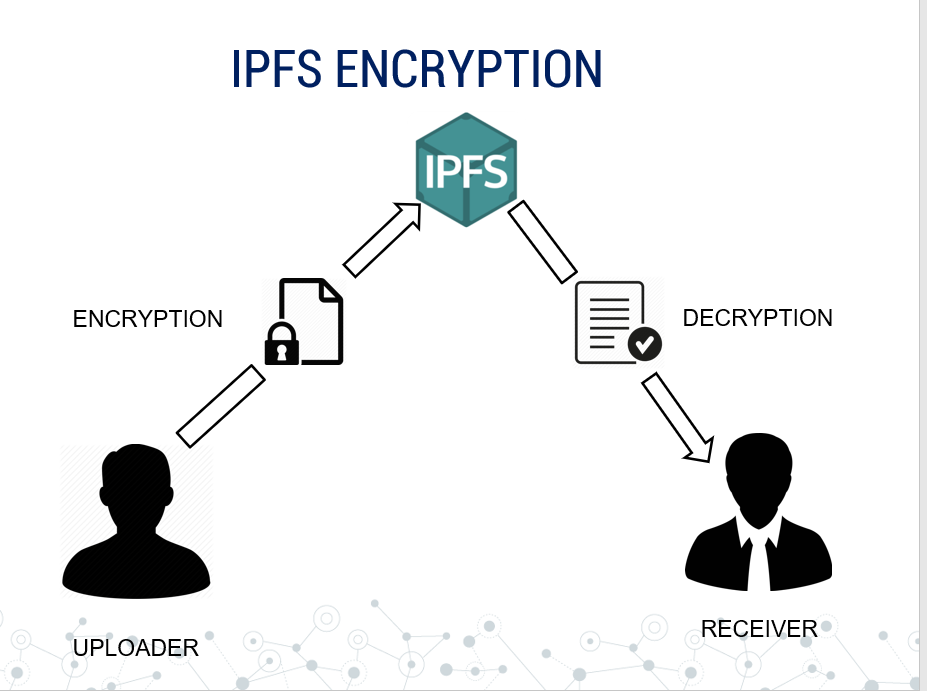

<!-- 

 
<!--         
        

<h1 align="center"> E-Verify </h1>
<h3 align="center"> Blockchain Based Certificate Validation <h3>
  

  
 
  
   
    
  
   
  
  
 
-->

##  E-Verify : About
- It is D-App on [Ethereum](https://www.ethereum.org/).
- Back-End has Smart Contract 
- Front-end of our Web-App is made with [React.Js](https://github.com/facebook/create-react-app) 
- All User-Data is stored on [IPFS](https://ipfs.io/) also every data is first encryted locally and then send to ipfs to have more security

 

- It create Multi-Sig Wallets for every student where both Student and his/her Institute is Owner.
- We are using [Metamask](https://metamask.io/) Browser Extension to work with Ethereum.
- We have used [Truffle](https://www.trufflesuite.com/) for testing our project

## Walkthrough
- Go to [Document](https://docs.google.com/document/d/1zlCLq1vHw5JCTFnyKbWK6TXB7Pfw9P94yeEHhqo5eJo/edit?usp=sharing) for complete walkthrough and documentation
